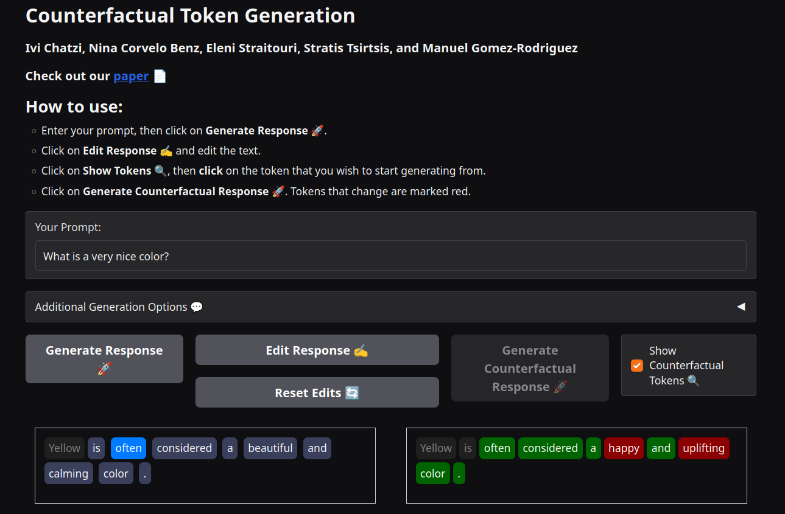

# Counterfactual Token Generation in Large Language Models

This repository contains the code for the demo web app of the paper ["Counterfactual Token Generation in Large Language Models"](https://arxiv.org/abs/2409.17027) by Ivi Chatzi, Nina Corvelo Benz, Eleni Straitouri, Stratis Tsirtsis, and Manuel Gomez-Rodriguez.

<div align="center">
  
</div>

## Dependencies

The demo was developed using Python 3.13.5.
In order to create a virtual environment and install the project dependencies you can run the following commands:

```bash
python3 -m venv .venv
source .venv/bin/activate
pip install -r requirements.txt
```

Our demo uses the large language model Llama 3.1 8B-instruct.
Llama is a "gated" model, that is, it requires licensing to use.
You can request to access it at: [https://huggingface.co/meta-llama/Llama-3.1-8B-Instruct](https://huggingface.co/meta-llama/Llama-3.1-8B-Instruct).
Once you have access, you can download any model in the Llama family.

Before launching the web app, login to Huggingface with `hf auth login`.
Then, you can launch locally on port 5000 with `./start.sh`.


## Contact & attribution

In case you have questions about the code, you identify potential bugs or you would like us to include additional functionalities, feel free to open an issue or contact [Ivi Chatzi](mailto:ichatzi@mpi-sws.org).

If you use parts of the code in this repository for your own research, please consider citing:

    @inproceedings{chatzi2024counterfactual,
      title={Counterfactual Token Generation in Large Language Models}, 
      author={Ivi Chatzi and Nina Corvelo Benz and Eleni Straitouri and Stratis Tsirtsis and Manuel Gomez-Rodriguez},
      year={2025},
      booktitle={Proceedings of the 4th conference on Causal Learning and Reasoning}
    }